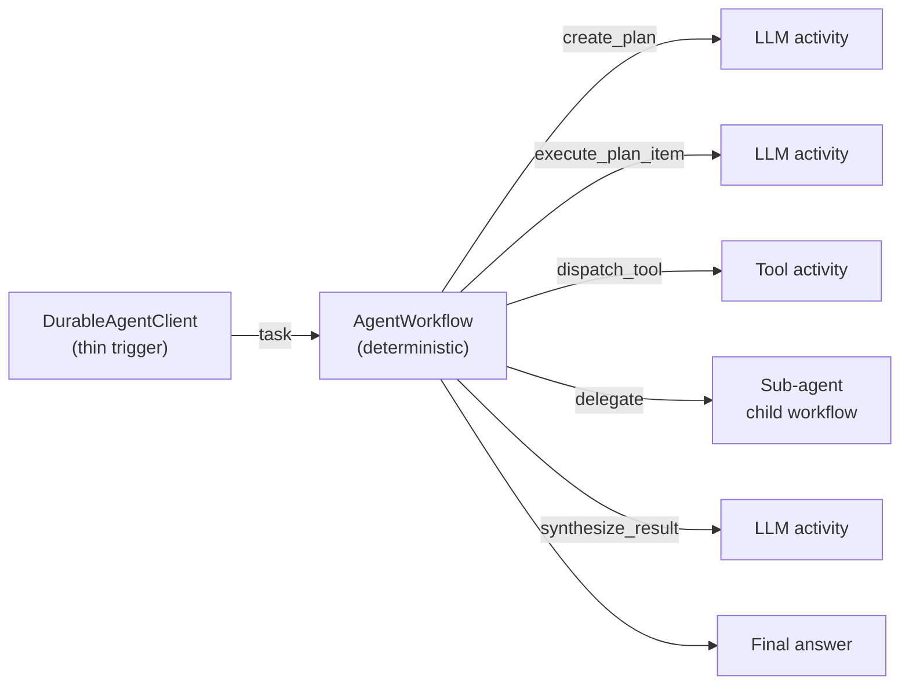

<div align="center">

# durable-agents

**Crash-proof, resumable AI agents — a DeepAgents-style developer experience backed by [Temporal](https://temporal.io) durable execution.**

[](https://www.python.org/)
[](https://temporal.io/)
[](https://platform.openai.com/)
[](https://docs.astral.sh/uv/)
[](#roadmap)
[](#license)
[](#contributing)

</div>

---

`durable-agents` is a small, extensible framework for building **multi-agent
systems that survive crashes, restarts, and infrastructure failures**. It gives
you the ergonomics of [DeepAgents](https://github.com/langchain-ai/deepagents) —
tools, skills, sub-agents, a plan-then-execute loop — but every step runs as a
**Temporal activity or child workflow**, so agent state lives in durable event
history instead of process memory.

Kill the worker mid-run and the agent resumes exactly where it left off. Every
LLM call, tool invocation, and delegation is retryable and visible in the
Temporal Web UI.

## Why durable-agents?

| Problem with in-memory agents | How durable-agents solves it |
|---|---|
| A crash loses the entire run | State is persisted in Temporal history; runs resume automatically |
| Transient API/network errors abort the agent | Activities retry with backoff, transparently |
| Bad LLM output crashes the loop | Malformed output becomes an *observation* the model corrects on the next step |
| Hard to observe what the agent did | Every step is an event in the Temporal Web UI |
| Long-running / human-in-the-loop work is fragile | Workflows can sleep for days and wake on a signal |

## Features

- 🧠 **Plan-then-execute loop** — the agent writes a structured plan, then executes each item, turning errors into recoverable observations.
- 🛠️ **Simple tool authoring** — decorate an `async` function with `@tool`; the JSON schema is generated for you.
- 👥 **Sub-agent delegation** — agents delegate to other agents that run as isolated child workflows.
- 🧩 **Composable skills** — bundle a system-prompt fragment and tools into a reusable `@skill`.
- 📁 **Built-in filesystem tools** — `read_file`, `write_file`, `list_dir`, `search_files`.
- 🪶 **Thin clients** — the client only needs a task-queue name; no tool imports, no schemas over the wire.
- ♻️ **Durable by construction** — built on Temporal's deterministic workflow / activity model.

## Architecture at a glance



The agent definition lives **only on the worker**. See
[docs/03-core-concepts.md](docs/03-core-concepts.md) for the full model.

## Quickstart

> Prerequisites: Python 3.11+, an OpenAI API key, [uv](https://docs.astral.sh/uv/), and Docker (or the Temporal CLI).

```bash
# 1. Install dependencies
uv sync

# 2. Configure secrets
cp .env.example .env          # set OPENAI_API_KEY

# 3. Start a local Temporal server (Web UI at http://localhost:8233)
docker compose up -d          # or: temporal server start-dev
```

Run the simplest example — start the worker, then submit a task:

```bash
# Terminal 1 — worker (blocks until Ctrl-C)
uv run python examples/01_research_agent/worker.py

# Terminal 2 — client
uv run python examples/01_research_agent/client.py "What is quantum entanglement?"
```

Define your own agent in a few lines:

```python
from durable_agents import create_durable_agent, tool

@tool
async def web_search(query: str) -> str:
    """Search the web for information about the given query."""
    return f"Results for {query}: ..."

agent = create_durable_agent(
    model="openai:gpt-4o-mini",
    tools=[web_search],
    system_prompt="You are a helpful research assistant.",
    task_queue="research-agent",
)

await agent.run_worker()   # worker side
# result = await agent.run("Research quantum computing")   # trigger side
```

## Documentation

Full documentation lives in [`docs/`](docs/):

| Chapter | Contents |
|---|---|
| [1 — Introduction](docs/01-introduction.md) | What it is, durable execution, design philosophy |
| [2 — Getting Started](docs/02-getting-started.md) | Install, environment, running your first agent |
| [3 — Core Concepts](docs/03-core-concepts.md) | Agent-on-worker, plan-then-execute, determinism |
| [4 — Defining Agents](docs/04-defining-agents.md) | `create_durable_agent` reference |
| [5 — Tools](docs/05-tools.md) | `@tool`, the registry, built-in filesystem tools |
| [6 — Sub-Agents](docs/06-sub-agents.md) | Delegation as child workflows |
| [7 — Skills](docs/07-skills.md) | The `@skill` decorator |
| [8 — Architecture](docs/08-architecture.md) | How it maps onto Temporal; data models |
| [9 — Examples](docs/09-examples.md) | Walkthrough of the bundled examples |
| [10 — Configuration](docs/10-configuration.md) | Environment-variable reference |
| [11 — Roadmap](docs/11-roadmap.md) | What's planned and why |

## Roadmap

`durable-agents` is **alpha**. The core loop, sub-agents, skills, and filesystem
tools work today. Planned next:

- 🧰 **More built-in tools** — shell execution and an MCP client.
- 🙋 **Human-in-the-loop** — pause for approval/input via Temporal signals.
- 🧠 **Persistent memory** — pluggable Postgres / Redis memory backends.
- 🔌 **More model providers** — beyond the current `openai:` prefix.
- 📈 **Observability & streaming** — OpenTelemetry, token streaming.

See [docs/11-roadmap.md](docs/11-roadmap.md) for details.

## Contributing

Contributions are welcome — see [CONTRIBUTING.md](CONTRIBUTING.md) for dev
setup, the test/lint workflow, and the Temporal determinism rules. Please open
an issue to discuss substantial changes first.

## License

Released under the [MIT License](LICENSE).
