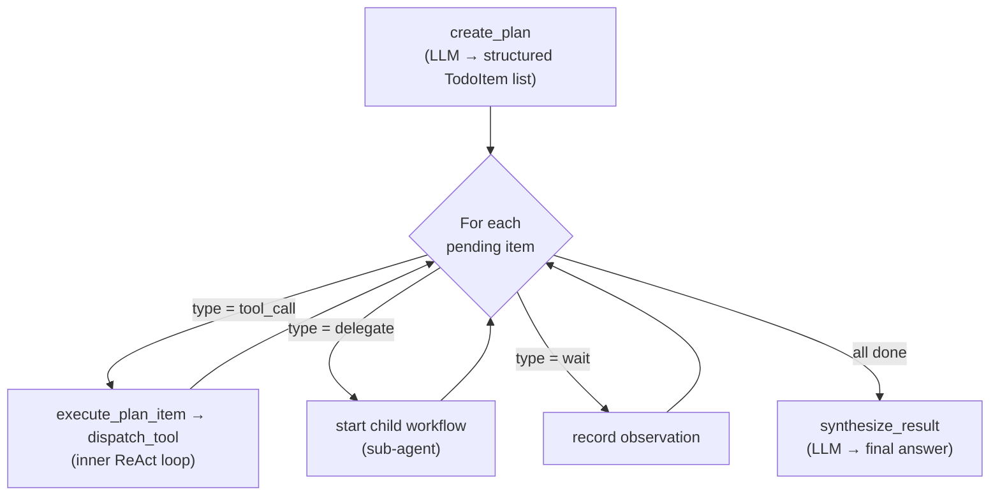

# 3. Core Concepts

> **On this page:** [The agent-on-worker model](#the-agent-on-worker-model) · [The plan-then-execute loop](#the-plan-then-execute-loop) · [Two retry layers](#two-retry-layers) · [Determinism rules](#determinism-rules)

Three ideas explain almost everything about how `durable-agents` behaves.

## The agent-on-worker model

The agent definition — its model, tools, system prompt, skills, and sub-agents —
lives **only on the worker process**. The worker *is* the agent.

```python
# worker.py — this process IS the agent
agent = create_durable_agent(
    model="openai:gpt-4o-mini",
    tools=[web_search],
    system_prompt="You are a helpful research assistant.",
    task_queue="research-agent",
)
await agent.run_worker()    # blocks; serves the task queue
```

A client never imports tools or knows the agent's schema. It only knows a
**task-queue name**:

```python
# client.py — thin, dependency-free
client = DurableAgentClient(task_queue="research-agent")
result = await client.run("What is quantum entanglement?")
```

When the client submits a task, it sends an `AgentInput` containing only the
`task` string and optional overrides (`model_override`, `max_steps`). **Tool
schemas are never sent over the wire** — activities read them from the worker's
local `ToolRegistry` at execution time.

Why this matters:

- **Thin clients.** A web request handler, a cron job, or another service can
  trigger an agent without depending on its implementation.
- **Single source of truth.** Tools and prompts are defined once, on the worker.
- **Clean security boundary.** Tool code and credentials stay on the worker.

See [Defining Agents](04-defining-agents.md) for the factory and
[Architecture](08-architecture.md) for how the registry is populated.

## The plan-then-execute loop

Every agent run follows a mandatory three-phase loop, and **each phase is a
Temporal activity**:



1. **`create_plan`** — the model produces a structured list of `TodoItem`
   entries, each typed `tool_call`, `delegate`, or `wait`.
2. **Execution loop** — for each pending item the workflow runs
   `execute_plan_item`. Tool items dispatch through `dispatch_tool`; delegate
   items start a sub-agent child workflow. Tool results — including *errors* —
   are threaded back as observations so the model can correct course.
3. **`synthesize_result`** — the model writes the final answer from the completed
   plan and the conversation history.

Because every phase is an activity, the loop is crash-proof, retryable, and fully
visible in the Temporal Web UI. The data structures (`Plan`, `TodoItem`,
`ItemResult`) are documented in [Architecture](08-architecture.md#data-models).

## Two retry layers

A recurring source of confusion is *where* a failure should be handled. The
framework deliberately uses **two distinct retry layers** with different jobs:

| Layer | Handles | Behaviour |
|---|---|---|
| **Temporal activity retry** | *Transient infrastructure* faults: network blips, rate limits, 5xx | Re-runs the **identical** work with backoff |
| **Plan-then-execute loop** | *Semantic* faults: malformed tool calls, bad arguments, missing files, wrong delegate targets | Feeds the error back as an **observation** so the model takes a **different** action |

The rule of thumb: if retrying the *exact same call* could succeed, it belongs to
Temporal. If success requires the model to *do something different*, it belongs to
the loop. Malformed LLM output is always the second kind — which is why the
framework turns it into an observation instead of crashing.

## Determinism rules

Workflow code is replayed from history, so it **must be deterministic**. These
are hard constraints — violating them breaks replay:

1. **No I/O in workflow code.** No network, no file access, no `random`, no
   `datetime.now()` inside a `@workflow.defn` method. Use `workflow.now()` for
   time.
2. **All side effects go in activities.** Every LLM call, tool invocation, and DB
   write is an `@activity.defn`.
3. **Wrap import side-effects.** Inside workflow files, imports that run
   module-level code (e.g. constructing an `AsyncOpenAI` client) must be guarded:
   ```python
   with workflow.unsafe.imports_passed_through():
       from durable_agents.activities.planner import create_plan
   ```
4. **Sub-agents are child workflows.** Each gets its own isolated event history.

You rarely write workflow code yourself — `AgentWorkflow` already follows these
rules — but the same constraints apply to any custom workflow you add.

Next: [Defining Agents](04-defining-agents.md).
