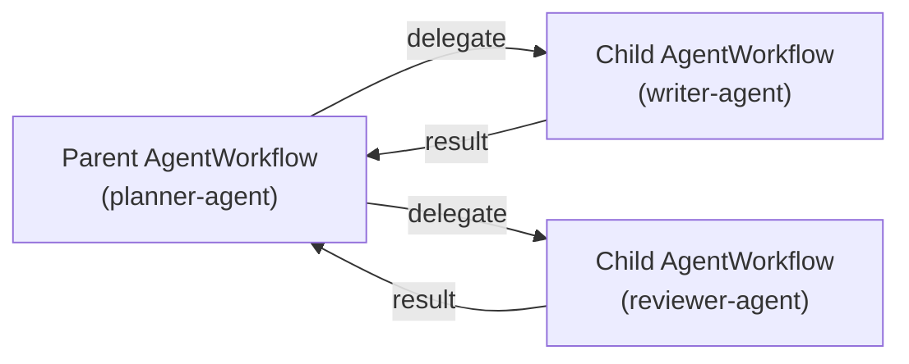

# 6. Sub-Agents

> **On this page:** [Why delegate](#why-delegate) · [Defining a sub-agent](#defining-a-sub-agent) · [Wiring sub-agents into a parent](#wiring-sub-agents-into-a-parent) · [How delegation works](#how-delegation-works) · [Running the topology](#running-the-topology) · [Context isolation](#context-isolation)

## Why delegate

A single agent with too many tools and responsibilities becomes hard to steer.
`durable-agents` lets you compose **specialised agents** — a researcher, a
writer, a reviewer — and have an orchestrator **delegate** to them. Each
sub-agent is a full agent in its own right, with its own model, tools, prompt,
and task queue.

Because each delegation is a **Temporal child workflow**, every sub-agent run
gets its own durable, replayable, independently-visible event history.

## Defining a sub-agent

A sub-agent is created exactly like any other agent — there is nothing special
about it until it is referenced by a parent:

```python
writer = create_durable_agent(
    model="openai:gpt-4o-mini",
    system_prompt="You write clear, concise prose from the given notes.",
    task_queue="writer-agent",
)

reviewer = create_durable_agent(
    model="openai:gpt-4o-mini",
    system_prompt="You critique drafts and suggest concrete improvements.",
    task_queue="reviewer-agent",
)
```

## Wiring sub-agents into a parent

Pass a `name → Agent` mapping to the parent via `sub_agents`:

```python
planner = create_durable_agent(
    model="openai:gpt-4o-mini",
    system_prompt="You plan work and delegate to your sub-agents.",
    sub_agents={
        "writer": writer,
        "reviewer": reviewer,
    },
    task_queue="planner-agent",
)
```

The parent's planner now knows it may emit `delegate` plan items targeting
`"writer"` or `"reviewer"`. The mapping also records each sub-agent's task queue
so delegation can route to the right worker.

## How delegation works

When the parent's `create_plan` produces a `TodoItem` of type `delegate`, the
workflow:

1. **Resolves the target task queue** from the *parent's own configuration* (the
   `sub_task_queue` field on the item), never a global registry — so the target
   is always trustworthy. An unknown sub-agent fails fast with a clear error.
2. **Crafts a self-contained task** for the child via the `prepare_delegation`
   activity, distilling the relevant parts of the parent's running history into a
   precise instruction. This is how prior results flow forward.
3. **Starts a child workflow** (`AgentWorkflow.run`) on the sub-agent's task
   queue with a deterministic child workflow ID.
4. **Threads the child's result** back into the parent's history as an
   observation, marks the item done, and continues the loop.



## Running the topology

Each agent serves its own task queue, so each needs a running worker. Serve them
together in one process with `asyncio.gather`:

```python
import asyncio

async def main() -> None:
    await asyncio.gather(
        planner.run_worker(),
        writer.run_worker(),
        reviewer.run_worker(),
    )

asyncio.run(main())
```

Then trigger only the **parent**; it orchestrates the rest:

```python
client = DurableAgentClient(task_queue="planner-agent")
result = await client.run("Write and review a short blog post about Temporal.")
```

In production you would typically run each worker as its own deployable process
and scale them independently — the only thing that ties them together is the
task-queue names.

## Context isolation

A key property: **the child starts with a clean context**. It does *not* inherit
the parent's full message history. Instead it receives only the crafted task from
`prepare_delegation`. This keeps each sub-agent focused and its token usage
bounded, while still letting curated results from earlier steps flow downstream.

The [Code Archaeologist example](09-examples.md#example-03--code-archaeologist)
demonstrates a four-agent pipeline built entirely on delegation.

Next: [Skills](07-skills.md).
